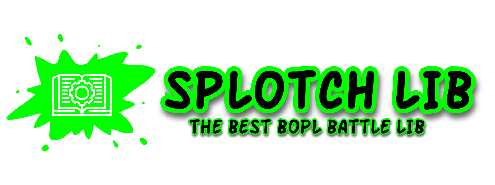

# SplotchLib

[](https://github.com/commandblox/Splotch)
[](https://github.com/commandblox/Splotch/releases)
[](#)
[](https://github.com/commandblox/Splotch/issues)
[](#)

SplotchLib is the next generation of [Splotch](https://github.com/codemob-dev/splotch) (A mod loader for the game [Bopl Battle]()), now designed as a [BepInEx]() library mod.

## Table of Contents
1. [Using](#usage-for-mod-makers)
2. [Roadmap](#roadmap)
3. [Contributing](#contributing)
4. [Credits](#credits)
5. [License](#license)
6. [Help](#help)


## Usage (for mod makers)
1. Add `SplotchLib.dll` as an assembly reference.
2. Update your mod's main class with this:
```c#
[BepInDependency("com.codemob.splotch")]
[BepInSplotch(authors: new string[]{ "Yourname" })]
[BepInPlugin("someGUID", "MyMod", "0.1.0")]
```
And add the reference:
```c#
using SplotchLib;
```

## Roadmap
### Basic
- [x] Basic functionality
- [x] Working API
- [x] Mod Names
### APIs
- [ ] BGL (Bopl Graphics Lib) (in progress)
- [ ] Ability API (in progress)
- [ ] Networking Lib (in progress)
### Other Features
- [x] General utility class

## Features
### Implemented
- Popups: Access various popup options and GUI features.
- Basic Utilities: Simple utility functions.
- Built-in Mod Names: Mod's Names will be displayed to the user on the main screen!

### Planned
- Networking: Enable multiplayer interactions.
- Custom Ability Creation: Design Custom abilities in your mod.

## Contributing
Contributions to SplotchLib are welcome! Feel free to check out the [issues](https://github.com/codemob-dev/SplotchLib/issues) and contribute in any way you can.

## Credits

ORIGINAL SPLOTCH
- **Developer**: Codemob
- **Developer**: WackyModer
- **Contributer**: Almafa64
- **Wiki, Docs & Contributer**: Melon

SPLOTCH LIB
- **Developer**: Codemob
- **Wiki, Docs**: Melon

## License
This project is licensed under the [WPFTL License](LICENSE).

## Help
If you need assistance, join our [Discord server](https://discord.gg/official-bopl-battle-modding-comunity-1175164882388275310). You can ask for help or discuss anything related to SplotchLib and modding for Bopl Battle.

That's it! You're ready to use SplotchLib in your mod!
